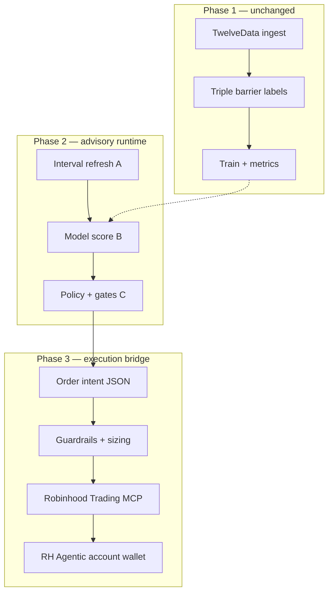

# Phase 3: Robinhood Agentic bridge and account growth

**Prerequisites:** **[plan.md](../plan.md)** Phase 1 complete (owner sign-off); **[plan-phase2-overview.md](plan-phase2-overview.md)** Plans A–C far enough along that `sparkles advisory` can score bars and emit structured signals in replay.

**Parent context:** Phase 2 was written as **recommendations only**. This plan **changes scope in writing** (owner request, 2026-06-20): Sparkles may eventually **place orders** on a **Robinhood Agentic account** through Robinhood’s **Trading MCP**, under **hard guardrails** and **owner-controlled funding**.

**External products (verify before each iteration):**

- [Robinhood Agentic Trading overview](https://robinhood.com/us/en/support/articles/agentic-trading-overview/) — separate Agentic account; MCP endpoint `https://agent.robinhood.com/mcp/trading`; Cursor listed as supported platform; trades only in Agentic wallet.
- [Robinhood day trading / intraday margin (June 2026)](https://robinhood.com/us/en/support/articles/day-trading/) — **$25k PDT minimum eliminated** (effective 2026-06-04); **$2,000 minimum equity** remains for **margin / leverage**, not for unleveraged cash trading.

---

## Owner goals (locked intent)

1. **Grow** a small account (currently **~$500**) toward **$2,000+** using Sparkles-assisted decisions.
2. **Connect** to Robinhood’s **Agentic Trading** product so an AI agent (hosted in **Cursor** and/or a Sparkles runtime) can **execute** within a **dedicated, pre-funded** Agentic sub-account.
3. **Preserve** Sparkles design law: **triple-barrier** exits, **`min_profit_per_trade_pct`**, and **vol-scaled** stops.
4. **Never** auto-trade from the main Robinhood portfolio—only the **Agentic wallet** the owner funds.

---

## Owner addendum — day-trade cap lifted (2026-06-20)

**Owner decision (in writing):** With FINRA’s old **pattern day trader trade-count** rule gone and a **~$500 cash** Agentic wallet, **do not enforce** the Phase 1 **3 day trades / 5 US business days** cap on **live advisory, paper broker, or Robinhood execution**.

| Context | Day-trade ledger (`max_day_trades` / `rolling_business_days`) |
|---------|----------------------------------------------------------------|
| **Phase 1 offline** (labels, research) | **Unchanged** — labels never used the ledger; YAML fields remain for docs/tests. |
| **Phase 2 advisory + Phase 3 execution** | **`enforce_day_trade_cap: false`** (default). Same-day round trips **allowed** for learning and model feedback. |
| **`sparkles risk day-trades` CLI** | **Optional** informational dry-run only; not a gate on orders. |
| **Re-enable cap later** | Set **`enforce_day_trade_cap: true`** in YAML if you want the old conservative behavior back. |

**Rationale (owner):** Unrestricted day trading on a small **cash** account maximizes **learning** for both the model and manual review, now that regulatory trade-count limits no longer apply.

**Still in force (unchanged guardrails):** position sizing caps, daily loss halt, kill switch, per-trade approval (Stage A), triple-barrier exits, cash-only until you opt into margin.

---

## Regulatory & product reality (plain language)

| Topic | What changed (2026) | What Sparkles assumes |
|-------|---------------------|------------------------|
| Old PDT ($25k, 4 day trades / 5 days) | Largely **removed**; replaced by **intraday margin** risk monitoring | **No internal day-trade count cap** on live path (owner addendum); ledger module kept **optional** |
| **$2,000** | Minimum to **borrow on margin** (leverage) | **Stage A** = cash-only, no margin intent; **Stage B** = revisit margin only after **≥ $2,000** equity **and** owner approval |
| ~$500 account | Can trade **cash-only** (no leverage) | Position sizing and **max % of agent wallet per trade** are **mandatory** in config |
| Robinhood Agentic | Beta; **stocks only**; MCP connection; optional **per-trade approval** | Default **approve every order** until owner opts out per stage |

**Not financial advice.** Sparkles encodes **your** rules; markets can lose money; agent errors are possible. Robinhood states you are responsible for agent-placed trades.

---

## Architecture (target)

**Division of labor:**

- **Sparkles** = data, features, model scores, barrier math, position sizing, **order intents** (symbol, side, qty, limit/market, reason codes). Optional day-trade ledger **logging only** when cap is off.
- **Robinhood MCP** = authenticated **read** (balances, positions, orders) and **write** (place/cancel) **only on Agentic account**.
- **Cursor** (optional host) = MCP client during early beta; long-term, Sparkles may invoke MCP via a thin adapter module.

---

## Account growth stages (owner modes)

Config key (future): `account_growth:` in experiment YAML.

| Stage | Equity (approx.) | Trading mode | Order approval | Margin |
|-------|------------------|--------------|----------------|--------|
| **A — Seed** | &lt; $2,000 (e.g. $500) | Cash-only; **small** Agentic wallet (owner chooses, e.g. $200–400) | **Every order** | No |
| **B — Standard** | ≥ $2,000 | Full Agentic wallet funding | Preview + batch approve, or auto per YAML | Owner opt-in only |
| **C — Scale** | Owner-defined | Same rules, larger size caps | Per owner policy | Only if explicitly enabled |

**Stage A constraints (required in D4):**

- `max_agent_wallet_pct_per_trade` (e.g. 0.25 = 25% of Agentic buying power)
- `max_open_positions: 1` (single-symbol RKLB aligns with Phase 1)
- `daily_loss_halt_pct` (e.g. 0.03 = stop initiating new entries after −3% day on Agentic wallet)
- **Kill switch** file (e.g. `data/advisory/KILL_SWITCH`) — if present, **no new orders**

---

## Relationship to Phase 2

| Phase 2 plan | Phase 3 change |
|--------------|----------------|
| **A — Data** | Unchanged; still credit-aware refresh |
| **B — Inference** | Unchanged; must match training features |
| **C — State / journal** | **Extend:** journal records **intents**, **submissions**, **fills** (from MCP read-back) |
| **“No broker execution”** | **Superseded for Phase 3** when owner approves each Phase 3 iteration |

**Suggested order:** Finish **Phase 2 B** (replay scoring) → **Phase 2 C1–C3** (position + policy; **skip ledger blocking** per addendum) → **Phase 3 D1–D3** (paper intents) → fund Agentic wallet → **D4–D6** (live guarded).

---

## Iteration roadmap (approval-gated)

### Iteration D1 — Robinhood MCP & scope document

- **Goal:** Lock integration assumptions: MCP URL, Agentic-only writes, Cursor setup steps, secrets handling, mapping Sparkles **signal** → **order intent** schema.
- **Deliverables:** This file (baseline); `docs/ROBINHOOD_MCP_SETUP.md` (owner checklist, desktop auth); example `order_intent` JSON schema in docs.
- **Done when:** Owner completes **read-only** MCP connect (portfolio read) on desktop **without** placing live orders.

**Owner approval to proceed to D2:** `[ ]` Date: ___________

### Iteration D2 — Order intent emitter (no broker calls)

- **Goal:** From Phase 2 advisory output, emit **`order_intent.jsonl`** (action, symbol, qty, type, barrier refs, model score; optional day-trade count for logging).
- **Deliverables:** `sparkles/broker/intent.py`, CLI `sparkles advisory intent --dry-run`, tests with fixture scores.
- **Done when:** Replay run produces intents; **zero** HTTP to Robinhood.

**Owner approval to proceed to D3:** `[ ]` Date: ___________

### Iteration D3 — Paper broker + growth-stage backtest

- **Goal:** Simulate **Stage A** fills against historical 1m bars with **$500** notional, commissions/slippage stub; **multiple same-day round trips allowed**.
- **Deliverables:** `sparkles/broker/paper.py`, YAML `account_growth`, report: equity curve, hit rate vs barriers.
- **Done when:** Owner runs paper backtest on RKLB window; metrics written under `artifacts/`.

**Owner approval to proceed to D4:** `[ ]` Date: ___________

### Iteration D4 — Guardrails module

- **Goal:** Central **pre-flight** checks: stage caps, daily loss halt, kill switch, min notional, max qty. **No** day-trade count block unless `enforce_day_trade_cap: true`.
- **Deliverables:** `sparkles/broker/guardrails.py`, unit tests; config validation in `schema.py`.
- **Done when:** Guardrails reject bad intents in tests; logged reason codes.

**Owner approval to proceed to D5:** `[ ]` Date: ___________

### Iteration D5 — MCP execution adapter (beta, approval required)

- **Goal:** Optional path: submit **approved** intents via Robinhood Trading MCP (or documented Cursor handoff if SDK unavailable in-process).
- **Deliverables:** `sparkles/broker/robinhood_mcp.py` **or** `docs/CURSOR_RH_HANDOFF.md` + skill; **default: manual approval**; read-back sync for positions.
- **Done when:** One **tiny** live round trip on Agentic wallet (owner present), journal line matches fill.

**Owner approval to proceed to D6:** `[ ]` Date: ___________

### Iteration D6 — Closed loop: score → intent → guard → MCP → journal

- **Goal:** End-to-end **Stage A** session: interval refresh, score, **unlimited same-day round trips** subject to sizing/loss halt only, full audit log.
- **Deliverables:** `sparkles advisory run --stage seed` (name TBD), runbook in `DEVELOPER.md`.
- **Done when:** Owner completes one full session document in progress log; kill switch tested.

**Owner approval (Phase 3 complete):** `[ ]` Date: ___________

---

## What we keep from Sparkles (non-negotiable)

- **Triple-barrier** parameters from YAML (`profit_barrier_base`, `stop_loss_base`, `min_profit_per_trade_pct`, vol lookback).
- **TwelveData credit discipline** — no tight polling loops; reuse Parquet.
- **Single symbol** until owner expands scope.
- **Secrets** — no API keys or Robinhood tokens in git; MCP auth via platform (Cursor) per Robinhood docs.

---

## Prerequisites before **any** live money

1. Phase 1 owner sign-off on **model quality** (`sparkles report`, optional `journal compare`).
2. Phase 2 **replay** matches expectations on recent RKLB data.
3. Paper backtest (**D3**) with **Stage A** caps shows acceptable drawdown **to you**.
4. Robinhood **Agentic account** opened on **desktop**; wallet funded with an amount you can afford to lose.
5. MCP connected with **approve every trade** until you explicitly relax in YAML.

---

## Deferred (Phase 3+)

- Options, crypto (Robinhood Agentic not there yet).
- Multi-symbol portfolio rebalancing via natural-language agent (Robinhood examples)—out of scope until single-symbol loop is stable.
- Replacing TwelveData with Robinhood quotes for training (different phase; inference may use RH read API later).

---

## Progress & change log (append-only)

| Date (ISO) | Summary | Iteration | Paths / notes |
|------------|---------|-----------|---------------|
| 2026-06-20 | Phase 3 plan drafted: Robinhood Agentic MCP bridge, $500 growth stages, D1–D6 roadmap; preserves triple-barrier. | Setup | `docs/plan-robinhood-agent-growth.md`, `docs/plan-phase2-overview.md`, `plan.md` |
| 2026-06-20 | **Owner addendum:** lift **3-in-5 day-trade cap** on Phase 2/3 live path (`enforce_day_trade_cap: false` default); unrestricted same-day round trips for learning; ledger optional/informational only. | Addendum | `docs/plan-robinhood-agent-growth.md`, `plan.md` |
