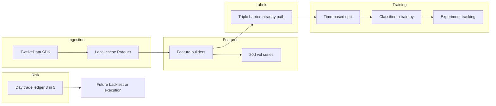

# Phase 1: Single-Symbol ML System (Day-Trade Cap)

## Mandatory rules for all agents and automation

These rules apply to **every** AI agent, script, or contributor working in this repository.

1. **Approval gate:** Do **not** begin work on the **next** iteration in the roadmap below until the **project owner explicitly approves** in chat (e.g. “Approved — proceed to Iteration 3”) **or** marks that iteration as approved in this file (checkbox / date line under that iteration).
2. **Single step focus:** Complete **at most one iteration** per owner request unless the owner explicitly asks to chain multiple iterations in one go.
3. **Progress log:** After substantive work, **append** a new entry to **[Progress & change log](#progress--change-log-append-only)** at the bottom of this file. Include: date (ISO `YYYY-MM-DD`), brief summary, files/paths touched, and which iteration is now complete or blocked.
4. **Source of truth:** This **`plan.md`** is authoritative for roadmap status and recent history. If anything conflicts, follow **`plan.md`** and confirm with the owner.
5. **Cursor:** Workspace rule **`.cursor/rules/sparkles-iterative-plan.mdc`** restates the approval and logging requirements for agents in the editor.
6. **API credits:** **Preserving TwelveData API credits is crucial** (free tier). Do not add redundant fetches, high-frequency polling, or aggressive retries that burn credits. Follow **`.cursor/rules/sparkles-api-credits.mdc`** and **[METHODOLOGY.md](METHODOLOGY.md)**.

## How iterations work

- Each **Iteration N** has a **goal**, **deliverables**, and **done when** criteria.
- **Status** is one of: `not started` | `in progress` | `complete — awaiting approval for N+1` | `approved — proceed to N+1`.
- The owner advances the project by approving the next iteration in chat or by editing the **Owner approval** line under that iteration.

---

## Iteration roadmap (approval-gated)

### Iteration 0 — Planning baseline

- **Goal:** Lock architecture, constraints, and developer map in this document.
- **Status:** **complete** (baseline established; iterative gates added).
- **Owner approval to proceed to Iteration 1:** Approved (owner chat).

### Iteration 1 — Scaffold

- **Goal:** Runnable package layout, dependencies, config schema stub, `DEVELOPER.md`, `configs/experiments/rklb_baseline.yaml` (RKLB, `min_profit_per_trade_pct`), `.env.example`.
- **Deliverables:** `pyproject.toml` or `requirements.txt`, `sparkles/` package with empty modules or stubs, Pydantic config loading, documented entrypoint placeholder.
- **Done when:** `pip install -e .` (or venv + deps) succeeds; owner can find symbol and training file paths in `DEVELOPER.md`.
- **Status:** `complete — awaiting approval for Iteration 2`
- **Owner approval to proceed to Iteration 2:** `[MH ]` Date: 4-9-26

### Iteration 2 — Data ingestion

- **Goal:** TwelveData 1m **historical** fetch (backfill for `data_start`–`data_end`), retries/rate limits, Parquet cache, `ingest` CLI. **Not in scope:** daemons, scheduled “live” polling, or near-real-time loops—that waits until after the owner accepts trained-model quality (see Context: historical-first policy).
- **Deliverables:** `twelvedata_client.py`, `retry.py`, `ingest.py`, documented env var for API key.
- **Done when:** Owner can run ingest for RKLB for a configured window and see cached Parquet.
- **Status:** `complete — awaiting approval for Iteration 3`
- **Owner approval to proceed to Iteration 3:** `[MH]` Date: 4-9-26

### Iteration 3 — Volatility

- **Goal:** 20-trading-day volatility aligned to bars without lookahead.
- **Deliverables:** `features/volatility.py` (or dedicated module), unit tests for alignment.
- **Done when:** Tests pass; vol series documented in `DEVELOPER.md`.
- **Status:** `complete — awaiting approval for Iteration 4`
- **Owner approval to proceed to Iteration 4:** `[MH]` Date: 4/9/2026

### Iteration 4 — Labels

- **Goal:** Triple barrier (15% / 5% vol-scaled, `min_profit_per_trade_pct` floor), intraday path scan, `label` CLI.
- **Deliverables:** `triple_barrier.py`, `types.py`, labeled dataset output path, summary stats on CLI.
- **Done when:** Owner can run `label` and inspect class/barrier distribution.
- **Status:** `complete — awaiting approval for Iteration 5`
- **Owner approval to proceed to Iteration 5:** `[MH]` Date: 4/10/2026

### Iteration 5 — Day-trade ledger

- **Goal:** Rolling 5 US business days, max 3 day trades; tests; optional CLI dry-run.
- **Deliverables:** `sparkles/risk/day_trade_ledger.py`, tests, doc in `DEVELOPER.md`.
- **Done when:** Tests pass; ledger API documented for future backtest/live.
- **Status:** `complete — awaiting approval for Iteration 6`
- **Owner approval to proceed to Iteration 6:** `[MH]` Date: 4/10/2026

### Iteration 6 — Features and training

- **Goal:** Feature builders, time-based split, baseline model in **`sparkles/models/train.py`**, artifacts + run logging.
- **Deliverables:** `features/*`, `train.py`, `registry.py`, `tracking/experiments.py` (or JSONL).
- **Done when:** Owner can run `train` and get a saved model + metrics.
- **Status:** `complete — awaiting approval for Iteration 7`
- **Owner approval to proceed to Iteration 7:** `[MH]` Date: 4/10/2026

### Iteration 7 — Phase 1 closure

- **Goal:** CLI polish (`ingest` → `label` → `train`), optional README pointer to `DEVELOPER.md`, owner sign-off.
- **Deliverables:** End-to-end smoke path documented; frontmatter todos updated to `complete` where true.
- **Status:** `complete` (code + docs; **formal owner sign-off** is the checkbox below when you are satisfied)
- **Owner approval (Phase 1 complete):** `[ ]` Date: ___________

---

## Context

- **Starting state:** Application code is built incrementally per the roadmap above; git repo initialized with `main` and `master` at same tip for tool compatibility.
- **Day-trade / PDT policy (design law):** The owner’s goal is to **avoid breaking the pattern day trader (PDT) band**, not to forbid day trades entirely. The program **may** use same-day round trips **only** within the cap: **at most 3 day trades in any rolling window of 5 consecutive US business days** (`max_day_trades` / `rolling_business_days` in config). That stays **below** the usual **4-in-5** trigger that applies under FINRA’s PDT framework (among other conditions). Enforcement lives in one module for **future** advisory / simulation paths. When the limit is exhausted, **do not** complete another same-day round trip (e.g. defer exit or skip—document in code and `DEVELOPER.md`).
- **Historical-first; no live polling until model sign-off:** Early iterations (**through training you are happy with**) use **batch historical** data only: pull a defined date range, cache, label, train. **Do not** add scheduled or continuous “live” TwelveData polling, streaming, or monitoring loops until the owner explicitly asks for that phase **after** they are satisfied with model performance. (Manual re-run of `ingest` for a new range is fine.)
- **No brokerage execution:** The program does **not** place orders or connect to wallets/brokers; any future “assistant” layer is **recommendations + logging** unless the owner changes scope in writing.
- **Labeling vs execution:** **Triple-barrier labels** use the **full 1-minute path from entry**, including **same-day** barrier touches. The **3-in-5 ledger** applies in **future** simulation/advisory use; optional future mode: labels that respect the ledger (defer unless requested).

## Developer guide (where to edit — readability)

Add **DEVELOPER.md** at the repo root: short “map” so you rarely hunt through the tree. It will repeat and expand on:

- **Ticker / practice symbol:** `configs/experiments/<name>.yaml` → field `symbol`. Phase 1 starter file: `configs/experiments/rklb_baseline.yaml` with **RKLB**. Use CLI `--config …`; avoid hardcoding symbols in Python.
- **Train/val dates, cache TTL, paths:** same experiment YAML.
- **Triple-barrier percents, vertical horizon, vol lookback:** same YAML; validated by Pydantic in `sparkles/config/` (e.g. `schema.py`).
- **Minimum profit per trade:** same YAML → `min_profit_per_trade_pct`. Logic only in `sparkles/labels/triple_barrier.py`; `DEVELOPER.md` states the exact formula (e.g. floor on TP after vol scaling).
- **Model family and many hparams:** YAML first; optional overrides in Python (see below).
- **Hands-on training (you edit Python):** **`sparkles/models/train.py`** — split, estimator, `fit`, save. Keep it **linear:** load → X/y → build model → fit → write artifact. Put “I’m experimenting” knobs in **`DEFAULT_TRAIN_KWARGS`** or **`build_estimator()`** at the **top** of `train.py`, with a one-line comment: “Stable hparams also in YAML under `model:`.”
- **Features:** `sparkles/features/*.py` (one theme per file).
- **Day-trade cap:** `sparkles/risk/day_trade_ledger.py` only.

**Readability conventions for `.py` files:** one short module docstring; public functions fully type-hinted; shallow nesting; no bare magic numbers (config or named constants); **`train.py`** and **`triple_barrier.py`** include a small header block: “If you change labeling horizons, see config YAML / features …”

## Default symbol for initial testing

- **Rocket Lab `RKLB`** in `configs/experiments/rklb_baseline.yaml`: `symbol: RKLB`, timezone `America/New_York`.

## Tuneable minimum profit per trade

- Config field `min_profit_per_trade_pct` (one documented convention, e.g. `0.02` = 2%).
- **Phase 1 default semantics:** floor the effective take-profit **move** after vol scaling: `effective_tp = max(min_profit_per_trade_pct, tp_move_from_vol)` (document in code + `DEVELOPER.md`). If you later add row-level filters, note that separately.
- Log this param on every training run.

## High-level architecture

## Recommended package layout (modular, PEP 8, strict typing)

All under package `sparkles/`:

- `sparkles/config/` — Pydantic models: `symbol`, dates, barrier params, `min_profit_per_trade_pct`, vol lookback, `max_day_trades: 3`, `rolling_business_days: 5`, model section, paths.
- `sparkles/data/twelvedata_client.py` — [twelvedata-python](https://github.com/twelvedata/twelvedata-python) wrapper → normalized `DataFrame`.
- `sparkles/data/ingest.py` — Chunked fetch, Parquet cache under `data/cache/`.
- `sparkles/data/retry.py` — Backoff, 429, timeouts.
- `sparkles/features/volatility.py` — 20 trading-day vol, no lookahead.
- `sparkles/labels/triple_barrier.py` — Barriers + min-profit floor; forward scan includes same session day.
- `sparkles/labels/types.py` — Outcome enums / TypedDicts.
- `sparkles/risk/day_trade_ledger.py` — Rolling 5 US business days, max 3 day-trade days; tests for weekends/holidays (calendar helper optional).
- `sparkles/models/train.py` — **Main training entrypoint you edit.**
- `sparkles/models/registry.py` — `artifacts/{symbol}/{run_id}/`.
- `sparkles/tracking/experiments.py` — MLflow or JSONL.
- `sparkles/cli.py` — `ingest`, `label`, `train`, `report`.
- `DEVELOPER.md` — Navigation guide (duplicate the bullets above in friendlier prose).

**Dependencies (indicative):** `twelvedata`, `pandas`, `numpy`, `pydantic`, `pyarrow`, `scikit-learn` and/or `xgboost`, `pyyaml`, optional `mlflow`, optional `pandas-market-calendars` for business days.

## Data ingestion (TwelveData, 1-minute)

- API key via env / gitignored `.env`.
- Chunking, cache-first, retries for timeouts and 429.

## Triple barrier (15% TP, 5% SL, 20-day vol, min profit floor)

- Vol scaling and clamps as before.
- **Effective TP move:** `max(min_profit_per_trade_pct, tp_move)`.
- Path scan: all 1m bars from entry through vertical expiry; same-day touches allowed for labels.

## Day-trade limit (3 in 5 rolling business days)

- Record each **US session date** on which a **round trip** (open and close same symbol same day) occurs.
- Before allowing a same-day close in sim or live: count such days in the rolling **5 US business days** ending at the decision date; if count ≥ **3**, **block** same-day close.
- Phase 1: ledger + unit tests + optional CLI dry-run; full simulator later.

## ML approach for Phase 1

- Classification from barrier outcomes; no feature leakage past `t0`.
- Time-ordered split; baseline in **`train.py`**.

## Oversight and workflow

1. `configs/experiments/rklb_baseline.yaml` — RKLB, barriers, `min_profit_per_trade_pct`, model hparams.
2. CLI: `ingest` → `label` → `train`.
3. Track params + metrics per run.

## Deferred

- Multi-asset, full slippage backtest, live broker APIs (still **no** auto-execution unless scope changes).
- **Live / interval ingestion** and **monitoring assistant** (journal, recommendations): after owner sign-off on model quality; tunable poll interval as a parameter when that phase is approved.

## Risk notes

- TwelveData intraday depth for RKLB; chunk if needed.
- Business-day counting: document if using a calendar library vs simplified NYSE schedule.
- RKLB is volatile; 1m barrier order can be noisy—acceptable for your test symbol.

---

## Progress & change log (append-only)

**Instructions:** Add new entries **only below** this line, newest at the bottom. Do not delete or rewrite prior entries.

| Date (ISO) | Summary | Paths / artifacts | Iteration |
|------------|---------|-------------------|-----------|
| 2026-04-07 | Iterative roadmap added: mandatory agent rules, approval gates per iteration, progress log; Cursor rule `.cursor/rules/sparkles-iterative-plan.mdc` added. Frontmatter todos remapped to iterations 1–7. | `plan.md`, `.cursor/rules/sparkles-iterative-plan.mdc` | Iteration 0 complete — **awaiting owner approval to start Iteration 1** |
| 2026-04-07 | **Iteration 1 complete:** `pyproject.toml` (deps + `sparkles` console script + ruff/mypy), full `sparkles/` package stubs, Pydantic `ExperimentConfig` + `load_experiment_config`, `configs/experiments/rklb_baseline.yaml`, `.env.example`, `DEVELOPER.md`. Verified `pip install -e ".[dev]"`, `sparkles ingest`, `ruff check`, `mypy sparkles`. | `pyproject.toml`, `sparkles/**`, `configs/experiments/rklb_baseline.yaml`, `.env.example`, `DEVELOPER.md`, `plan.md` | **Blocked until owner approves Iteration 2** (data ingestion) |
| 2026-04-07 | **Owner clarification:** PDT intent is **avoid breaking the pattern** (keep **3 day trades / 5 business days**), not zero day trades. **Historical-first:** Iteration 2+ ingest remains **batch historical** only; **no live/scheduled API polling** until owner is satisfied with trained model and approves a later phase. `DEVELOPER.md` + overview + Deferred updated. | `plan.md`, `DEVELOPER.md` | Still **blocked on Iteration 2 approval**; scope unchanged for current roadmap |
| 2026-04-09 | **Iteration 2 complete:** `retry.py` (backoff, retryable errors), `ResilientHttpClient` + `fetch_ohlcv_1min`, `ingest.run_ingest` with calendar chunking, Parquet cache + TTL, CLI `ingest --force/--verbose`. Config: `ingest_chunk_calendar_days`, `twelvedata_outputsize`, `http_timeout_seconds`, `retry_max_attempts`, `twelvedata_exchange`. Dev: `pandas-stubs`, `types-requests`, mypy overrides for `twelvedata`. Tests: `tests/test_ingest_windows.py`. | `sparkles/data/*.py`, `sparkles/cli.py`, `sparkles/config/schema.py`, `pyproject.toml`, `tests/`, `DEVELOPER.md`, `plan.md` | **Blocked until owner approves Iteration 3** (volatility) |
| 2026-04-09 | **TwelveData free-tier ingest:** pause **20s** between chunks; on per-minute credit errors sleep **~65s** then retry (not fast exponential backoff); default chunk **10** calendar days; `rklb_baseline.yaml` documents tuning. `is_per_minute_credit_exhausted_error` + `tests/test_retry_credits.py`. | `retry.py`, `twelvedata_client.py`, `ingest.py`, `schema.py`, `rklb_baseline.yaml`, `DEVELOPER.md`, `plan.md` | Iteration 3 approval unchanged |
| 2026-04-09 | **Docs + agent rules:** `.cursor/rules/sparkles-api-credits.mdc` (always apply: preserve API credits). **`METHODOLOGY.md`** (end-to-end methodology). **`README.md`** (GitHub quick start). `plan.md` mandatory rule #6; `pyproject` readme → `README.md`; `DEVELOPER.md` links updated. | `.cursor/rules/`, `METHODOLOGY.md`, `README.md`, `DEVELOPER.md`, `plan.md`, `pyproject.toml` | Iteration 3 approval unchanged |
| 2026-04-09 | **Iteration 3 complete:** `sparkles/features/volatility.py` — daily last close, rolling log-return std with `shift(1)` (no lookahead), √252 `vol_{N}d_ann` + `sigma_daily_{N}d`, `add_volatility_from_config`. Tests `tests/test_volatility.py`. `DEVELOPER.md` + `METHODOLOGY.md` updated; `features/__init__.py` exports. | `sparkles/features/`, `tests/test_volatility.py`, `DEVELOPER.md`, `METHODOLOGY.md`, `plan.md` | **Blocked until owner approves Iteration 4** (labels) |
| 2026-04-07 | **Iteration 4 complete:** `triple_barrier.py` — vol-scaled barriers (clamped), min-profit TP floor, trading-day vertical, pessimistic same-bar SL-before-TP; `BarrierOutcome` + `END_OF_DATA`. Config: `barrier_vol_scale_min` / `max`, `label_entry_stride` (default 390). CLI `sparkles label -c …` writes `{SYMBOL}_labeled_{start}_{end}_s{stride}.parquet` and prints `barrier_outcome` value counts. Tests `tests/test_triple_barrier.py`. | `sparkles/labels/`, `sparkles/config/schema.py`, `sparkles/cli.py`, `tests/test_triple_barrier.py`, `DEVELOPER.md`, `plan.md` | **Blocked until owner approves Iteration 5** (day-trade ledger) |
| 2026-04-10 | **Iteration 5 complete:** `DayTradeLedger` + `rolling_us_business_days_ending` / `anchor_us_weekday_date` (weekdays only; no holiday calendar v1). CLI `sparkles risk day-trades`. Tests `tests/test_day_trade_ledger.py`. **README.md** + **METHODOLOGY.md**: purpose / general use (Phase 1 offline vs future advisory + models). | `sparkles/risk/`, `sparkles/cli.py`, `tests/test_day_trade_ledger.py`, `DEVELOPER.md`, `README.md`, `METHODOLOGY.md`, `plan.md` | **Blocked until owner approves Iteration 6** (features + train) |
| 2026-04-10 | **Iteration 6 complete:** `features/dataset.py` (entry-only X + session-date masks); `train.run_train` + `build_estimator` (logistic regression from `model:`); `registry` paths; `tracking/experiments.jsonl`; CLI `sparkles train`; dependency **scikit-learn** in core `pyproject.toml`. Tests `tests/test_dataset.py`, `tests/test_train_smoke.py`. | `sparkles/features/`, `sparkles/models/`, `sparkles/tracking/`, `sparkles/config/schema.py`, `sparkles/cli.py`, `pyproject.toml`, `tests/`, `DEVELOPER.md`, `README.md`, `METHODOLOGY.md`, `plan.md` | **Blocked until owner approves Iteration 7** (closure) |
| 2026-04-11 | **Iteration 7 complete:** `sparkles report` + `sparkles/reporting/summary.py` (cache paths, latest `metrics.json`, `experiments.jsonl` tail, optional `--run`); `train` echoes headline accuracies; README + DEVELOPER smoke path and DEVELOPER pointer; METHODOLOGY closure row. Tests `tests/test_reporting.py`. | `sparkles/reporting/`, `sparkles/cli.py`, `tests/test_reporting.py`, `README.md`, `DEVELOPER.md`, `METHODOLOGY.md`, `plan.md` | **Phase 1 roadmap complete** — owner may mark **Owner approval (Phase 1 complete)** above when satisfied |
| 2026-04-11 | **ML expansion living doc:** **`docs/ML_EXPANSION.md`** — plan-style frontmatter + phased roadmap (A–F) for YAML-driven models, feature registry, preprocessing pipeline, and evaluation; append-only progress log; habits for agents. **`DEVELOPER.md`** one-line pointer. | `docs/ML_EXPANSION.md`, `DEVELOPER.md`, `plan.md` | **Post–Phase 1** (orthogonal to iteration gates; advance phases per owner priority) |
| 2026-04-11 | **Repo layout / hygiene:** **`DEVELOPER.md`** repository layout table; **`docs/README.md`**; **`scripts/README.md`**; **`.gitignore`** extended with **`artifacts/`** and **`.ruff_cache/`**. | `.gitignore`, `docs/README.md`, `scripts/README.md`, `DEVELOPER.md`, `README.md`, `METHODOLOGY.md`, `docs/ML_EXPANSION.md`, `plan.md` | **Housekeeping** |
| 2026-04-10 | **ML expansion Phase A:** **`TrainConfig`** + extended **`ModelConfig`** (solver, tol, class_weight); **`run_train`** wiring and **`experiments.jsonl`** extras; tests and doc/config pointers. See **`docs/ML_EXPANSION.md`**. | `sparkles/config/schema.py`, `sparkles/models/train.py`, `sparkles/config/__init__.py`, `tests/test_train_smoke.py`, `DEVELOPER.md`, `configs/experiments/rklb_baseline.yaml`, `docs/ML_EXPANSION.md`, `plan.md` | **Post–Phase 1** (ML expansion) |
| 2026-04-10 | **ML expansion Phase B:** **`FeatureConfig`** / **`features:`** YAML, **`builders`** + **`registry`**, refactored **`build_feature_matrix`**; metrics + experiment log carry feature flags. | `sparkles/features/builders.py`, `sparkles/features/registry.py`, `sparkles/features/dataset.py`, `sparkles/config/schema.py`, `sparkles/models/train.py`, `tests/test_dataset.py`, `tests/test_schema_features.py`, `DEVELOPER.md`, `configs/experiments/rklb_baseline.yaml`, `docs/ML_EXPANSION.md`, `plan.md` | **Post–Phase 1** (ML expansion) |
| 2026-04-10 | **ML expansion Phase C:** **`sparkles/models/estimators.py`** factory; **`xgboost_classifier`** + **`[ml]`** extra; **`model_type`** in **`metrics.json`** / report; **`train`** CLI echo. | `sparkles/models/estimators.py`, `sparkles/models/train.py`, `sparkles/config/schema.py`, `sparkles/reporting/summary.py`, `sparkles/cli.py`, `tests/test_estimators.py`, `tests/test_train_smoke.py`, `DEVELOPER.md`, `README.md`, `docs/ML_EXPANSION.md`, `plan.md` | **Post–Phase 1** (ML expansion) |
| 2026-04-10 | **Predictions export + journal compare:** **`train.export_predictions`** (`val`/`all`/`none`) → **`predictions.parquet`**; **`JournalConfig`** + **`journal compare`** CLI; **`sparkles/journal/compare.py`**; example CSV; **`data/journal/`** + **`.gitignore`**. | `sparkles/models/predictions_export.py`, `sparkles/journal/`, `sparkles/models/train.py`, `sparkles/config/schema.py`, `sparkles/cli.py`, `tests/test_predictions_journal.py`, `DEVELOPER.md`, `README.md`, `METHODOLOGY.md`, `configs/`, `plan.md` | **Post–Phase 1** |
| 2026-04-12 | **`label_entry_stride`** documented in **`configs/experiments/rklb_baseline.yaml`** (comments + explicit `390`); **`DEVELOPER.md`** / **`README.md`** pointers; **`METHODOLOGY.md`** new §11 (stride intent, session vs every minute, PDT note). | `configs/experiments/rklb_baseline.yaml`, `DEVELOPER.md`, `README.md`, `METHODOLOGY.md`, `plan.md` | **Docs / config clarity** |
| 2026-06-20 | **Phase 3 plan (owner request):** Robinhood Agentic Trading MCP bridge, account growth stages (~$500→$2k+), iterations D1–D6; preserves triple-barrier + day-trade ledger. See **`docs/plan-robinhood-agent-growth.md`**. | `docs/plan-robinhood-agent-growth.md`, `docs/plan-phase2-overview.md`, `plan.md` | **Post–Phase 1 planning** (blocked until owner approves Phase 2/3 iterations) |
| 2026-06-20 | **Phase 3 addendum (owner):** **Lift 3-in-5 day-trade cap** on live/advisory/Robinhood path—`enforce_day_trade_cap: false` default; same-day round trips allowed on ~$500 cash for learning. Ledger stays optional. | `docs/plan-robinhood-agent-growth.md`, `plan.md` | **Post–Phase 1 planning** |
| 2026-06-20 | **ML expansion Phase E complete (owner approved):** `train --dry-run`, preset overlays, `scripts/run_trials.py`, config merge loader. | `sparkles/models/train.py`, `sparkles/config/load.py`, `sparkles/cli.py`, `scripts/run_trials.py`, `configs/experiments/presets/`, `tests/`, `DEVELOPER.md`, `METHODOLOGY.md`, `docs/ML_EXPANSION.md`, `plan.md` | **Post–Phase 1** (ML expansion) |
| 2026-06-20 | **Notebook training console:** `notebooks/sparkles_train_console.ipynb` (dry-run, train, trials table, charts); optional `[notebook]` extra in `pyproject.toml`. | `notebooks/`, `pyproject.toml`, `plan.md` | **Housekeeping / UX** |
| 2026-06-20 | **ML expansion Phase F complete (owner approved):** macro/weighted F1 in metrics.json, experiments.jsonl, CLI, report, CSV export. | `sparkles/models/evaluation.py`, `sparkles/models/train.py`, `sparkles/reporting/summary.py`, `sparkles/tracking/experiments_csv.py`, `sparkles/cli.py`, `tests/`, `docs/ML_EXPANSION.md`, `plan.md` | **Post–Phase 1** (ML expansion) |
| 2026-06-20 | **ML expansion Phase D complete (owner approved):** optional preprocess scaler Pipeline (train-only fit); bundle reload helpers. | `sparkles/config/schema.py`, `sparkles/models/preprocess.py`, `sparkles/models/train.py`, `tests/test_preprocess.py`, `DEVELOPER.md`, `docs/ML_EXPANSION.md`, `plan.md` | **Post–Phase 1** (ML expansion) |
| 2026-06-20 | **Champion preset saved:** `configs/experiments/presets/xgb_d3_reg_v1.yaml` + notebook OVERRIDES (best val F1 run `20260620T181553`). | `configs/experiments/presets/`, `notebooks/sparkles_train_console.ipynb`, `DEVELOPER.md`, `plan.md` | **Research / trials** |
| 2026-06-20 | **ML expansion Phases G–I planned:** feature-engineering backlog (G1–G3), multi-symbol Phase H, AFML Phase I; features-before-symbols guidance in **`docs/ML_EXPANSION.md`**. | `docs/ML_EXPANSION.md`, `plan.md` | **Post–Phase 1** (ML expansion planning) |
| 2026-06-20 | **ML expansion Phase G1 complete (owner approved):** trailing returns, realized vol, Parkinson/ATR feature groups; preset **`g1_features_v1.yaml`**. | `sparkles/features/intraday.py`, `sparkles/config/schema.py`, `configs/experiments/presets/g1_features_v1.yaml`, `tests/test_intraday_features.py`, `DEVELOPER.md`, `docs/ML_EXPANSION.md`, `plan.md` | **Post–Phase 1** (ML expansion G1) |
| 2026-06-21 | **Day-trade label experiment v1:** `configs/experiments/rklb_daytrade_v1.yaml` (15% TP / 10% SL / 12% min profit / 1-day vertical / stride 15); preset **`rklb_daytrade_g1_v1.yaml`**; tests **`test_daytrade_config.py`**. | `configs/experiments/`, `DEVELOPER.md`, `configs/experiments/presets/README.md`, `plan.md` | **Research / day-trade labels** |
| 2026-06-21 | **Day-trade label v2:** `rklb_daytrade_v2.yaml` (3% TP / 5% SL / 1.5% min profit); **`label_cache_suffix`** for distinct Parquet (`…_s15_dt_v2.parquet`); preset **`rklb_daytrade_v2_g1.yaml`**. | `sparkles/config/schema.py`, `sparkles/labels/triple_barrier.py`, `configs/experiments/`, `tests/`, `DEVELOPER.md`, `plan.md` | **Research / day-trade labels** |
| 2026-06-21 | **Trials table UX:** `experiments.jsonl` + notebook log **`train_accuracy`**, **`label_entry_stride`**; CSV column priority; notebook backfill from `metrics.json` / nested config for older runs. | `sparkles/models/train.py`, `sparkles/tracking/experiments_csv.py`, `notebooks/sparkles_train_console.ipynb`, `plan.md` | **Research / UX** |
| 2026-06-21 | **ML expansion Phase G3 complete (owner approved):** bar microstructure, market_context (SPY/VIX); **`context_ingest`** YAML + ingest hook; preset **`rklb_daytrade_g1_g2_g3_v1.yaml`**. | `sparkles/features/microstructure.py`, `sparkles/features/market_context.py`, `sparkles/data/context_ingest.py`, `sparkles/config/schema.py`, `configs/experiments/rklb_daytrade_v2.yaml`, `tests/test_g3_features.py`, `DEVELOPER.md`, `docs/ML_EXPANSION.md`, `plan.md` | **Post–Phase 1** (ML expansion G3) |
| 2026-06-21 | **Ingest per-symbol CLI:** **`sparkles ingest --symbol --interval`**; each ticker cached independently (RKLB cache no longer skips SPY/VIX). | `sparkles/data/ingest.py`, `sparkles/cli.py`, `tests/test_ingest_targets.py`, `DEVELOPER.md`, `docs/ML_EXPANSION.md`, `plan.md` | **Post–Phase 1** (ingest UX) |
| 2026-06-21 | **VIX ingest fix:** TwelveData has no spot VIX/^VIX; use **VIXY** `1day` + **`twelvedata_exchange: CBOE`**; clear error if VIX requested. | `sparkles/data/symbol_hints.py`, `configs/experiments/rklb_daytrade_v2.yaml`, `sparkles/features/market_data.py`, tests, docs | **Post–Phase 1** (ingest UX) |
| 2026-06-21 | **market_context tz fix:** localize naive label timestamps before SPY join (was dropping all rows → dry-run train_n=0). | `sparkles/features/dataset.py`, `sparkles/features/market_context.py`, `tests/test_market_context_tz.py`, `plan.md` | **Post–Phase 1** (G3 bugfix) |
| 2026-06-21 | **Day-trade champion preset + Phase I roadmap:** **`rklb_daytrade_champion_v1.yaml`** (Trial_RB_G1_G2_G3_v1 hyperparams/features); **`docs/ML_EXPANSION.md`** Phase I expanded into approval-gated **I1** (val backtest) → **I2** (TP threshold) → **I3** (meta-label spike) → optional **I4+**. | `configs/experiments/presets/rklb_daytrade_champion_v1.yaml`, `configs/experiments/presets/README.md`, `docs/ML_EXPANSION.md`, `DEVELOPER.md`, `plan.md` | **Post–Phase 1** (Phase I planning) — **blocked until owner approves I1** |
| 2026-06-21 | **Phase I1 complete (owner approved):** **`sparkles backtest`** — val policy PnL from predictions + labeled cache; **`sparkles/backtest/`**; **`backtest_summary.json`**; day-trade cap simulation; tests **`test_val_backtest.py`**. | `sparkles/backtest/`, `sparkles/cli.py`, `tests/test_val_backtest.py`, `DEVELOPER.md`, `docs/ML_EXPANSION.md`, `plan.md` | **Phase I1** — **blocked until owner approves I2** |
| 2026-06-21 | **Phase I2 complete (owner approved):** TP threshold policy (**`--threshold`**, **`--sweep`**); **`train.entry_threshold_take_profit`**; sweep artifacts; tests **`test_threshold_sweep.py`**. | `sparkles/backtest/threshold_sweep.py`, `sparkles/config/schema.py`, `sparkles/cli.py`, `tests/`, `DEVELOPER.md`, `docs/ML_EXPANSION.md`, `plan.md` | **Phase I2** — **blocked until owner approves I3** |
| 2026-06-21 | **Phase I3 complete (owner approved):** **`sparkles meta-label train/compare`**; meta filter on primary-gated signals; tests **`test_meta_label.py`**. Fixed invalid trailing YAML in **`rklb_daytrade_v2.yaml`**. | `sparkles/backtest/meta_label.py`, `sparkles/cli.py`, `sparkles/config/schema.py`, `configs/experiments/rklb_daytrade_v2.yaml`, `tests/`, `DEVELOPER.md`, `docs/ML_EXPANSION.md`, `plan.md` | **Phase I3** — **blocked until owner approves I4+ or H** |
| 2026-06-21 | **Phase I4 complete (owner approved):** **`train.sample_weight_method: uniqueness`** — AFML label-uniqueness weights at fit; opt-in YAML; tests **`test_sample_weights.py`**. | `sparkles/models/sample_weights.py`, `sparkles/models/train.py`, `sparkles/config/schema.py`, `tests/`, `DEVELOPER.md`, `docs/ML_EXPANSION.md`, `plan.md` | **Phase I4** — **blocked until owner approves I4b/c or H** |
| 2026-06-23 | **Day-trade v3 baseline corrected:** **`rklb_daytrade_v3.yaml`** from full grid-best **val_f1_macro 0.5624** (`20260623T032329_428232Z`, 15360 combos); refit grid updated. | `configs/experiments/rklb_daytrade_v3.yaml`, `configs/experiments/grids/rklb_daytrade_xgb_v3_refit.yaml`, `plan.md` | **Research / trials** |
| 2026-06-23 | **Phase G4+ planned (doc only):** G4a RSI/EMA/MACD → G4b day-of-week → G4c OHLCV order-flow proxies → G4d fractional diff; approval-gated; see **`docs/ML_EXPANSION.md`**. | `docs/ML_EXPANSION.md`, `DEVELOPER.md`, `plan.md` | **Phase G4+ planning** |
| 2026-06-23 | **Phase G4a complete (owner approved):** **`technical_indicators`** — EMA dist, Wilder RSI, MACD; preset **`rklb_daytrade_v3_g4a.yaml`**; tests **`test_technical_features.py`**. | `sparkles/features/technical.py`, `sparkles/config/schema.py`, `sparkles/features/registry.py`, `sparkles/features/dataset.py`, `configs/experiments/presets/`, `tests/`, `docs/ML_EXPANSION.md`, `plan.md` | **Phase G4a** — **blocked until owner approves G4b** |
| 2026-06-20 | **Phase G4b complete (owner approved):** **`session_day_of_week`** — `sin_dow`, `cos_dow`; builder in **`session.py`**; preset **`rklb_daytrade_v3_g4b.yaml`**; tests **`test_session_features.py`**. | `sparkles/features/session.py`, `sparkles/config/schema.py`, `sparkles/features/registry.py`, `configs/experiments/presets/rklb_daytrade_v3_g4b.yaml`, `tests/`, `notebooks/sparkles_train_console.ipynb`, `DEVELOPER.md`, `docs/ML_EXPANSION.md`, `plan.md` | **Phase G4b** — **blocked until owner approves G4c** |
| 2026-06-20 | **Phase G4c complete (owner approved):** **`order_flow_proxies`** — OHLCV spread/illiquidity proxies; **`sparkles/features/order_flow.py`**; preset **`rklb_daytrade_v3_g4c.yaml`**; tests **`test_order_flow_features.py`**. | `sparkles/features/order_flow.py`, `sparkles/config/schema.py`, `sparkles/features/registry.py`, `sparkles/features/dataset.py`, `configs/experiments/presets/`, `tests/`, `notebooks/sparkles_train_console.ipynb`, `DEVELOPER.md`, `docs/ML_EXPANSION.md`, `plan.md` | **Phase G4c** — **blocked until owner approves G4d** |
