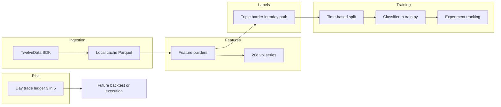

# Phase 1: Single-Symbol ML System (Day-Trade Cap)

## Mandatory rules for all agents and automation

These rules apply to **every** AI agent, script, or contributor working in this repository.

1. **Approval gate:** Do **not** begin work on the **next** iteration in the roadmap below until the **project owner explicitly approves** in chat (e.g. “Approved — proceed to Iteration 3”) **or** marks that iteration as approved in this file (checkbox / date line under that iteration).
2. **Single step focus:** Complete **at most one iteration** per owner request unless the owner explicitly asks to chain multiple iterations in one go.
3. **Progress log:** After substantive work, **append** a new entry to **[Progress & change log](#progress--change-log-append-only)** at the bottom of this file. Include: date (ISO `YYYY-MM-DD`), brief summary, files/paths touched, and which iteration is now complete or blocked.
4. **Source of truth:** This **`plan.md`** is authoritative for roadmap status and recent history. If anything conflicts, follow **`plan.md`** and confirm with the owner.
5. **Cursor:** Workspace rule **`.cursor/rules/sparkles-iterative-plan.mdc`** restates the approval and logging requirements for agents in the editor.

## How iterations work

- Each **Iteration N** has a **goal**, **deliverables**, and **done when** criteria.
- **Status** is one of: `not started` | `in progress` | `complete — awaiting approval for N+1` | `approved — proceed to N+1`.
- The owner advances the project by approving the next iteration in chat or by editing the **Owner approval** line under that iteration.

---

## Iteration roadmap (approval-gated)

### Iteration 0 — Planning baseline

- **Goal:** Lock architecture, constraints, and developer map in this document.
- **Status:** **complete** (baseline established; iterative gates added).
- **Owner approval to proceed to Iteration 1:** `[ ]` Approve by checking the box and adding date/name, or say so in chat.

### Iteration 1 — Scaffold

- **Goal:** Runnable package layout, dependencies, config schema stub, `DEVELOPER.md`, `configs/experiments/rklb_baseline.yaml` (RKLB, `min_profit_per_trade_pct`), `.env.example`.
- **Deliverables:** `pyproject.toml` or `requirements.txt`, `sparkles/` package with empty modules or stubs, Pydantic config loading, documented entrypoint placeholder.
- **Done when:** `pip install -e .` (or venv + deps) succeeds; owner can find symbol and training file paths in `DEVELOPER.md`.
- **Status:** `complete — awaiting approval for Iteration 2`
- **Owner approval to proceed to Iteration 2:** `[ ]` Date: ___________

### Iteration 2 — Data ingestion

- **Goal:** TwelveData 1m fetch, retries/rate limits, Parquet cache, `ingest` CLI.
- **Deliverables:** `twelvedata_client.py`, `retry.py`, `ingest.py`, documented env var for API key.
- **Done when:** Owner can run ingest for RKLB for a configured window and see cached Parquet.
- **Status:** `not started`
- **Owner approval to proceed to Iteration 3:** `[ ]` Date: ___________

### Iteration 3 — Volatility

- **Goal:** 20-trading-day volatility aligned to bars without lookahead.
- **Deliverables:** `features/volatility.py` (or dedicated module), unit tests for alignment.
- **Done when:** Tests pass; vol series documented in `DEVELOPER.md`.
- **Status:** `not started`
- **Owner approval to proceed to Iteration 4:** `[ ]` Date: ___________

### Iteration 4 — Labels

- **Goal:** Triple barrier (15% / 5% vol-scaled, `min_profit_per_trade_pct` floor), intraday path scan, `label` CLI.
- **Deliverables:** `triple_barrier.py`, `types.py`, labeled dataset output path, summary stats on CLI.
- **Done when:** Owner can run `label` and inspect class/barrier distribution.
- **Status:** `not started`
- **Owner approval to proceed to Iteration 5:** `[ ]` Date: ___________

### Iteration 5 — Day-trade ledger

- **Goal:** Rolling 5 US business days, max 3 day trades; tests; optional CLI dry-run.
- **Deliverables:** `sparkles/risk/day_trade_ledger.py`, tests, doc in `DEVELOPER.md`.
- **Done when:** Tests pass; ledger API documented for future backtest/live.
- **Status:** `not started`
- **Owner approval to proceed to Iteration 6:** `[ ]` Date: ___________

### Iteration 6 — Features and training

- **Goal:** Feature builders, time-based split, baseline model in **`sparkles/models/train.py`**, artifacts + run logging.
- **Deliverables:** `features/*`, `train.py`, `registry.py`, `tracking/experiments.py` (or JSONL).
- **Done when:** Owner can run `train` and get a saved model + metrics.
- **Status:** `not started`
- **Owner approval to proceed to Iteration 7:** `[ ]` Date: ___________

### Iteration 7 — Phase 1 closure

- **Goal:** CLI polish (`ingest` → `label` → `train`), optional README pointer to `DEVELOPER.md`, owner sign-off.
- **Deliverables:** End-to-end smoke path documented; frontmatter todos updated to `complete` where true.
- **Status:** `not started`
- **Owner approval (Phase 1 complete):** `[ ]` Date: ___________

---

## Context

- **Starting state:** Application code is built incrementally per the roadmap above; git repo initialized with `main` and `master` at same tip for tool compatibility.
- **Day-trade / PDT policy (design law):** The program **may** open and close the same position on the **same US equity session day** (a day trade). It must **never** exceed **3 day trades within any rolling window of 5 consecutive US business days**. That is a **conservative** reading relative to FINRA’s pattern day trader framing (often **4** day trades in 5 business days triggers PDT rules among other conditions). Enforcement lives in one module for **backtest, paper, or live** paths. When the limit is exhausted, **do not** complete a same-day round trip (e.g. defer exit or skip—document in code and `DEVELOPER.md`).
- **Labeling vs execution:** **Triple-barrier labels** use the **full 1-minute path from entry**, including **same-day** barrier touches. The **3-in-5 ledger** applies in simulation/execution; optional future mode: labels that respect the ledger (defer unless requested).

## Developer guide (where to edit — readability)

Add **DEVELOPER.md** at the repo root: short “map” so you rarely hunt through the tree. It will repeat and expand on:

- **Ticker / practice symbol:** `configs/experiments/<name>.yaml` → field `symbol`. Phase 1 starter file: `configs/experiments/rklb_baseline.yaml` with **RKLB**. Use CLI `--config …`; avoid hardcoding symbols in Python.
- **Train/val dates, cache TTL, paths:** same experiment YAML.
- **Triple-barrier percents, vertical horizon, vol lookback:** same YAML; validated by Pydantic in `sparkles/config/` (e.g. `schema.py`).
- **Minimum profit per trade:** same YAML → `min_profit_per_trade_pct`. Logic only in `sparkles/labels/triple_barrier.py`; `DEVELOPER.md` states the exact formula (e.g. floor on TP after vol scaling).
- **Model family and many hparams:** YAML first; optional overrides in Python (see below).
- **Hands-on training (you edit Python):** **`sparkles/models/train.py`** — split, estimator, `fit`, save. Keep it **linear:** load → X/y → build model → fit → write artifact. Put “I’m experimenting” knobs in **`DEFAULT_TRAIN_KWARGS`** or **`build_estimator()`** at the **top** of `train.py`, with a one-line comment: “Stable hparams also in YAML under `model:`.”
- **Features:** `sparkles/features/*.py` (one theme per file).
- **Day-trade cap:** `sparkles/risk/day_trade_ledger.py` only.

**Readability conventions for `.py` files:** one short module docstring; public functions fully type-hinted; shallow nesting; no bare magic numbers (config or named constants); **`train.py`** and **`triple_barrier.py`** include a small header block: “If you change labeling horizons, see config YAML / features …”

## Default symbol for initial testing

- **Rocket Lab `RKLB`** in `configs/experiments/rklb_baseline.yaml`: `symbol: RKLB`, timezone `America/New_York`.

## Tuneable minimum profit per trade

- Config field `min_profit_per_trade_pct` (one documented convention, e.g. `0.02` = 2%).
- **Phase 1 default semantics:** floor the effective take-profit **move** after vol scaling: `effective_tp = max(min_profit_per_trade_pct, tp_move_from_vol)` (document in code + `DEVELOPER.md`). If you later add row-level filters, note that separately.
- Log this param on every training run.

## High-level architecture

## Recommended package layout (modular, PEP 8, strict typing)

All under package `sparkles/`:

- `sparkles/config/` — Pydantic models: `symbol`, dates, barrier params, `min_profit_per_trade_pct`, vol lookback, `max_day_trades: 3`, `rolling_business_days: 5`, model section, paths.
- `sparkles/data/twelvedata_client.py` — [twelvedata-python](https://github.com/twelvedata/twelvedata-python) wrapper → normalized `DataFrame`.
- `sparkles/data/ingest.py` — Chunked fetch, Parquet cache under `data/cache/`.
- `sparkles/data/retry.py` — Backoff, 429, timeouts.
- `sparkles/features/volatility.py` — 20 trading-day vol, no lookahead.
- `sparkles/labels/triple_barrier.py` — Barriers + min-profit floor; forward scan includes same session day.
- `sparkles/labels/types.py` — Outcome enums / TypedDicts.
- `sparkles/risk/day_trade_ledger.py` — Rolling 5 US business days, max 3 day-trade days; tests for weekends/holidays (calendar helper optional).
- `sparkles/models/train.py` — **Main training entrypoint you edit.**
- `sparkles/models/registry.py` — `artifacts/{symbol}/{run_id}/`.
- `sparkles/tracking/experiments.py` — MLflow or JSONL.
- `sparkles/cli.py` — `ingest`, `label`, `train`, `report`.
- `DEVELOPER.md` — Navigation guide (duplicate the bullets above in friendlier prose).

**Dependencies (indicative):** `twelvedata`, `pandas`, `numpy`, `pydantic`, `pyarrow`, `scikit-learn` and/or `xgboost`, `pyyaml`, optional `mlflow`, optional `pandas-market-calendars` for business days.

## Data ingestion (TwelveData, 1-minute)

- API key via env / gitignored `.env`.
- Chunking, cache-first, retries for timeouts and 429.

## Triple barrier (15% TP, 5% SL, 20-day vol, min profit floor)

- Vol scaling and clamps as before.
- **Effective TP move:** `max(min_profit_per_trade_pct, tp_move)`.
- Path scan: all 1m bars from entry through vertical expiry; same-day touches allowed for labels.

## Day-trade limit (3 in 5 rolling business days)

- Record each **US session date** on which a **round trip** (open and close same symbol same day) occurs.
- Before allowing a same-day close in sim or live: count such days in the rolling **5 US business days** ending at the decision date; if count ≥ **3**, **block** same-day close.
- Phase 1: ledger + unit tests + optional CLI dry-run; full simulator later.

## ML approach for Phase 1

- Classification from barrier outcomes; no feature leakage past `t0`.
- Time-ordered split; baseline in **`train.py`**.

## Oversight and workflow

1. `configs/experiments/rklb_baseline.yaml` — RKLB, barriers, `min_profit_per_trade_pct`, model hparams.
2. CLI: `ingest` → `label` → `train`.
3. Track params + metrics per run.

## Deferred

- Multi-asset, live broker, full slippage backtest.

## Risk notes

- TwelveData intraday depth for RKLB; chunk if needed.
- Business-day counting: document if using a calendar library vs simplified NYSE schedule.
- RKLB is volatile; 1m barrier order can be noisy—acceptable for your test symbol.

---

## Progress & change log (append-only)

**Instructions:** Add new entries **only below** this line, newest at the bottom. Do not delete or rewrite prior entries.

| Date (ISO) | Summary | Paths / artifacts | Iteration |
|------------|---------|-------------------|-----------|
| 2026-04-07 | Iterative roadmap added: mandatory agent rules, approval gates per iteration, progress log; Cursor rule `.cursor/rules/sparkles-iterative-plan.mdc` added. Frontmatter todos remapped to iterations 1–7. | `plan.md`, `.cursor/rules/sparkles-iterative-plan.mdc` | Iteration 0 complete — **awaiting owner approval to start Iteration 1** |
| 2026-04-07 | **Iteration 1 complete:** `pyproject.toml` (deps + `sparkles` console script + ruff/mypy), full `sparkles/` package stubs, Pydantic `ExperimentConfig` + `load_experiment_config`, `configs/experiments/rklb_baseline.yaml`, `.env.example`, `DEVELOPER.md`. Verified `pip install -e ".[dev]"`, `sparkles ingest`, `ruff check`, `mypy sparkles`. | `pyproject.toml`, `sparkles/**`, `configs/experiments/rklb_baseline.yaml`, `.env.example`, `DEVELOPER.md`, `plan.md` | **Blocked until owner approves Iteration 2** (data ingestion) |
