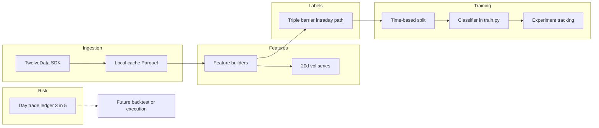

# Phase 1: Single-Symbol ML System (Day-Trade Cap)

## Context

- **Starting state:** This workspace has no application code yet; this plan defines layout, modules, and workflows.
- **Day-trade / PDT policy (design law):** The program **may** open and close the same position on the **same US equity session day** (a day trade). It must **never** exceed **3 day trades within any rolling window of 5 consecutive US business days**. That is a **conservative** reading of the pattern-day-trader band (FINRA counts toward PDT when you exceed **4** day trades in 5 business days, among other conditions); capping at 3 keeps you below that trigger. Enforcement lives in one module used by any future **backtest, paper, or live** execution path. When the limit is exhausted, the policy must **not** complete a same-day round trip (e.g. defer exit to next session or skip the signal—behavior documented in code and `DEVELOPER.md`).
- **Labeling vs execution:** Phase 1 **triple-barrier labels** use the **full 1-minute path from entry**, including **same-day** barrier touches, so the model sees realistic intraday outcomes. The **3-in-5 day-trade ledger** applies when simulating or placing orders; if you later want labels that assume the ledger is always binding, that becomes a separate configurable mode (defer unless you ask).

## Developer guide (where to edit — readability)

Add **DEVELOPER.md** at the repo root: short “map” so you rarely hunt through the tree. It will repeat and expand on:

- **Ticker / practice symbol:** `configs/experiments/<name>.yaml` → field `symbol`. Phase 1 starter file: `configs/experiments/rklb_baseline.yaml` with **RKLB**. Use CLI `--config …`; avoid hardcoding symbols in Python.
- **Train/val dates, cache TTL, paths:** same experiment YAML.
- **Triple-barrier percents, vertical horizon, vol lookback:** same YAML; validated by Pydantic in `sparkles/config/` (e.g. `schema.py`).
- **Minimum profit per trade:** same YAML → `min_profit_per_trade_pct`. Logic only in `sparkles/labels/triple_barrier.py`; `DEVELOPER.md` states the exact formula (e.g. floor on TP after vol scaling).
- **Model family and many hparams:** YAML first; optional overrides in Python (see below).
- **Hands-on training (you edit Python):** **`sparkles/models/train.py`** — the file to open for split, estimator, `fit`, save. Keep it **linear:** load → X/y → build model → fit → write artifact. Put “I’m experimenting” knobs in **`DEFAULT_TRAIN_KWARGS`** or **`build_estimator()`** at the **top** of `train.py`, with a one-line comment: “Stable hparams also in YAML under `model:`.”
- **Features:** `sparkles/features/*.py` (one theme per file).
- **Day-trade cap:** `sparkles/risk/day_trade_ledger.py` only.

**Readability conventions for `.py` files:** one short module docstring; public functions fully type-hinted; shallow nesting; no bare magic numbers (config or named constants); **`train.py`** and **`triple_barrier.py`** include a small header block: “If you change labeling horizons, see config YAML / features …”

## Default symbol for initial testing

- **Rocket Lab `RKLB`** in `configs/experiments/rklb_baseline.yaml`: `symbol: RKLB`, timezone `America/New_York`.

## Tuneable minimum profit per trade

- Config field `min_profit_per_trade_pct` (one documented convention, e.g. `0.02` = 2%).
- **Phase 1 default semantics:** floor the effective take-profit **move** after vol scaling: `effective_tp = max(min_profit_per_trade_pct, tp_move_from_vol)` (document in code + `DEVELOPER.md`). If you later add row-level filters, note that separately.
- Log this param on every training run.

## High-level architecture

## Recommended package layout (modular, PEP 8, strict typing)

All under package `sparkles/`:

- `sparkles/config/` — Pydantic models: `symbol`, dates, barrier params, `min_profit_per_trade_pct`, vol lookback, `max_day_trades: 3`, `rolling_business_days: 5`, model section, paths.
- `sparkles/data/twelvedata_client.py` — [twelvedata-python](https://github.com/twelvedata/twelvedata-python) wrapper → normalized `DataFrame`.
- `sparkles/data/ingest.py` — Chunked fetch, Parquet cache under `data/cache/`.
- `sparkles/data/retry.py` — Backoff, 429, timeouts.
- `sparkles/features/volatility.py` — 20 trading-day vol, no lookahead.
- `sparkles/labels/triple_barrier.py` — Barriers + min-profit floor; forward scan includes same session day.
- `sparkles/labels/types.py` — Outcome enums / TypedDicts.
- `sparkles/risk/day_trade_ledger.py` — Rolling 5 US business days, max 3 day-trade days; tests for weekends/holidays (calendar helper optional).
- `sparkles/models/train.py` — **Main training entrypoint you edit.**
- `sparkles/models/registry.py` — `artifacts/{symbol}/{run_id}/`.
- `sparkles/tracking/experiments.py` — MLflow or JSONL.
- `sparkles/cli.py` — `ingest`, `label`, `train`, `report`.
- `DEVELOPER.md` — Navigation guide (duplicate the bullets above in friendlier prose).

**Dependencies (indicative):** `twelvedata`, `pandas`, `numpy`, `pydantic`, `pyarrow`, `scikit-learn` and/or `xgboost`, `pyyaml`, optional `mlflow`, optional `pandas-market-calendars` for business days.

## Data ingestion (TwelveData, 1-minute)

- API key via env / gitignored `.env`.
- Chunking, cache-first, retries for timeouts and 429.

## Triple barrier (15% TP, 5% SL, 20-day vol, min profit floor)

- Vol scaling and clamps as before.
- **Effective TP move:** `max(min_profit_per_trade_pct, tp_move)`.
- Path scan: all 1m bars from entry through vertical expiry; same-day touches allowed for labels.

## Day-trade limit (3 in 5 rolling business days)

- Record each **US session date** on which a **round trip** (open and close same symbol same day) occurs.
- Before allowing a same-day close in sim or live: count such days in the rolling **5 US business days** ending at the decision date; if count ≥ **3**, **block** same-day close.
- Phase 1: ledger + unit tests + optional CLI dry-run; full simulator later.

## ML approach for Phase 1

- Classification from barrier outcomes; no feature leakage past `t0`.
- Time-ordered split; baseline in **`train.py`**.

## Oversight and workflow

1. `configs/experiments/rklb_baseline.yaml` — RKLB, barriers, `min_profit_per_trade_pct`, model hparams.
2. CLI: `ingest` → `label` → `train`.
3. Track params + metrics per run.

## Deferred

- Multi-asset, live broker, full slippage backtest.

## Implementation order

1. Scaffold + `DEVELOPER.md` + `configs/experiments/rklb_baseline.yaml` (RKLB, `min_profit_per_trade_pct`).
2. TwelveData ingest + cache.
3. Vol alignment tests.
4. Triple barrier + label CLI.
5. `day_trade_ledger` + tests.
6. Features + `train.py` + artifacts + logging.
7. Optional README line pointing to `DEVELOPER.md`.

## Risk notes

- TwelveData intraday depth for RKLB; chunk if needed.
- Business-day counting: document if using a calendar library vs simplified NYSE schedule.
- RKLB is volatile; 1m barrier order can be noisy—acceptable for your test symbol.
